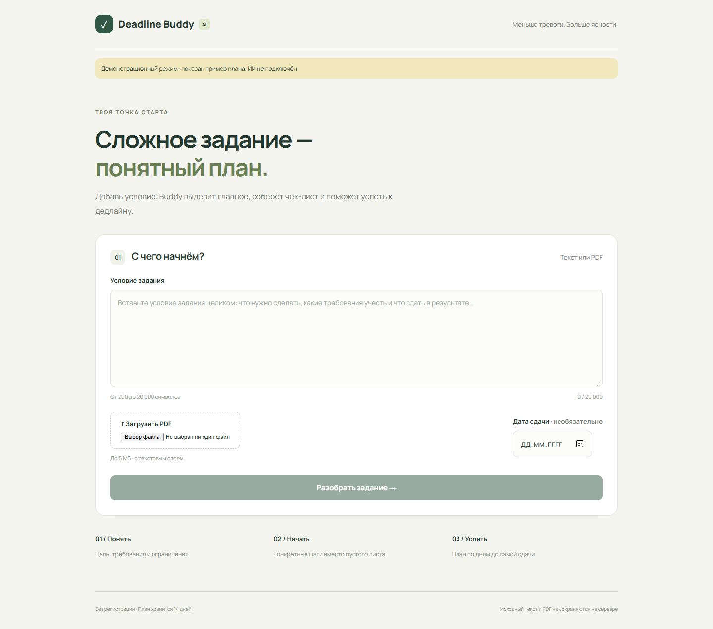
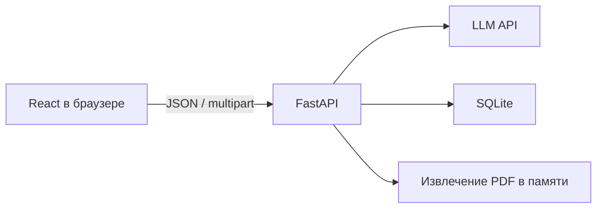

# Deadline Buddy AI

MVP по ТЗ: разбор учебного задания, чек-лист и план до дедлайна. React + FastAPI + SQLite, без регистрации.



## Быстрый запуск

Нужны Python 3.12+, Node.js 22+ и pnpm 11.25.0 (`npm install -g pnpm@11.25.0`).

Из корня проекта:

```powershell
python -m venv .venv
.\.venv\Scripts\python.exe -m pip install -r backend/requirements.lock.txt
Copy-Item backend/.env.example backend/.env
cd frontend
pnpm install --frozen-lockfile
pnpm build
cd ..
.\.venv\Scripts\python.exe -m uvicorn main:app --app-dir backend --host 127.0.0.1 --port 8000 --no-access-log
```

Перед запуском заполните `backend/.env`: `LLM_API_KEY`, `LLM_BASE_URL`, `LLM_MODEL`. Поддерживается совместимый с Chat Completions API провайдер с JSON-ответом. Модель должна поддерживать `temperature`, `max_tokens`, `response_format: json_object`.

Для просмотра без ключа установите `DEMO_MODE=true`. Он возвращает фиксированный пример, а интерфейс явно показывает, что ИИ не подключён. Для настоящего разбора верните `DEMO_MODE=false`.

Откройте [http://127.0.0.1:8000](http://127.0.0.1:8000). Swagger: [/docs](http://127.0.0.1:8000/docs).

На Linux вместо `.venv\Scripts\python.exe` используется `.venv/bin/python`, а `.env` копируется командой `cp backend/.env.example backend/.env`.

Для разработки запустите сервер и отдельно `pnpm dev` из `frontend`. Vite проксирует `/api` на порт 8000. После изменения frontend для обычного запуска нужно повторить `pnpm build`.

## Тесты

```powershell
cd backend
..\.venv\Scripts\python.exe -m pytest -q
```

Проверены 15 сценариев API, сборка frontend и браузерный путь: ввод → разбор → отметка → дедлайн → перезагрузка. Проверена мобильная ширина 390 px. Вызовы провайдера в тестах имитируются через HTTP mock; три учебных задания прогнаны в деморежиме. Реальный LLM без ключа не проверялся.

Дополнительный браузерный сценарий: установите Playwright в отдельное окружение и запустите `node browser-check.cjs` при работающем сервере с `DEMO_MODE=true`. По умолчанию используется установленный Edge; `BROWSER_CHANNEL=chrome` переключает на Chrome. Если пакет установлен вне проекта, укажите `PLAYWRIGHT_MODULE` — путь к модулю `playwright`. Скрипт сохраняет скриншоты в `docs/screenshots`.

## API

| Метод | Путь | Назначение |
|---|---|---|
| POST | `/api/analyze` | JSON `{text, deadline_date?}` или multipart `text`, `file`, `deadline_date` |
| GET | `/api/plan` | Восстановить план по cookie |
| POST | `/api/plan/deadline` | `{session_id, deadline_date}` |
| PATCH | `/api/steps/{id}` | `{session_id, done}` |
| GET | `/api/config` | Признак демонстрационного режима |

Ошибки имеют формат `{code, message}`. Идентификатор сессии — секрет доступа к плану, его не следует передавать другим. Cookie: HttpOnly, SameSite=Lax; за HTTPS задайте `COOKIE_SECURE=true`.

## Архитектура и данные



В SQLite хранятся Session → Plan → Requirement / Step. Исходное условие в БД не записывается. Временный multipart-файл закрывается сразу после чтения; PDF обрабатывается в памяти. Тело запросов не логируется приложением. Удаление истёкших сессий выполняется при старте и раз в минуту, связанные записи удаляются каскадно. Повторный разбор заменяет текущий план только после успешного ответа модели. Сессия живёт 14 дней с момента создания.

Неоднозначности ТЗ разрешены следующим образом:

- Текст длиннее 20 000 символов после нормализации отклоняется с `TEXT_TOO_LONG`, а не обрезается молча.
- Шаги распределяются по диапазону от сегодня до дедлайна включительно. Даты не убывают, последний шаг приходится на дедлайн. На один день могут попасть несколько шагов; при длинном сроке возможны свободные дни.
- Промпт просит 5–12 шагов; проверка допускает 3–12, согласно нижней границе валидности из ТЗ.
- На весь разбор выделено 29 секунд, на HTTP-вызов — 25. Повтор некорректного JSON выполняется в пределах общего бюджета.
- «Сегодня» определяется часовым поясом сервера. При размещении настройте TZ для аудитории продукта.

## Развёртывание

Подготовлены `Dockerfile` и `compose.yaml`:

```sh
cp backend/.env.example backend/.env
# Заполните backend/.env
docker compose up --build -d
```

SQLite хранится в Docker volume. Приложение слушает локальный порт 8000. На VPS настройте reverse proxy с HTTPS, ограничение размера тела 6 МБ и таймаут не менее 35 секунд. Пример для Nginx:

```nginx
location / {
    client_max_body_size 6m;
    proxy_pass http://127.0.0.1:8000;
    proxy_set_header Host $host;
    proxy_set_header X-Forwarded-Proto $scheme;
    proxy_read_timeout 35s;
}
```

Запускайте один процесс Uvicorn: лимит пяти параллельных разборов действует на процесс. Docker-сборка и VPS-деплой в этой среде не выполнялись. Публичного URL пока нет.

## Документация

- [Отчёт и инструкция пользователя по предоставленному шаблону](REPORT.md)
- [Системный промпт](backend/prompts/analyze.txt)
- [Конфигурация лимитов](backend/config.yaml)

Аккаунты, оплата, Telegram, OCR и облачная история не входят в MVP.
