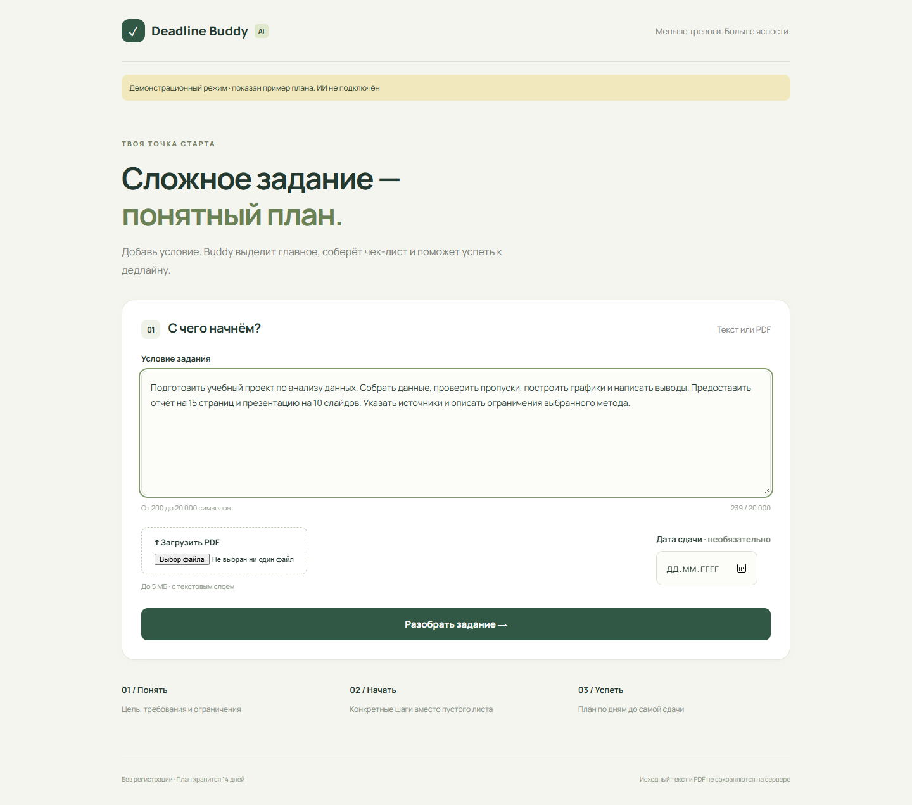
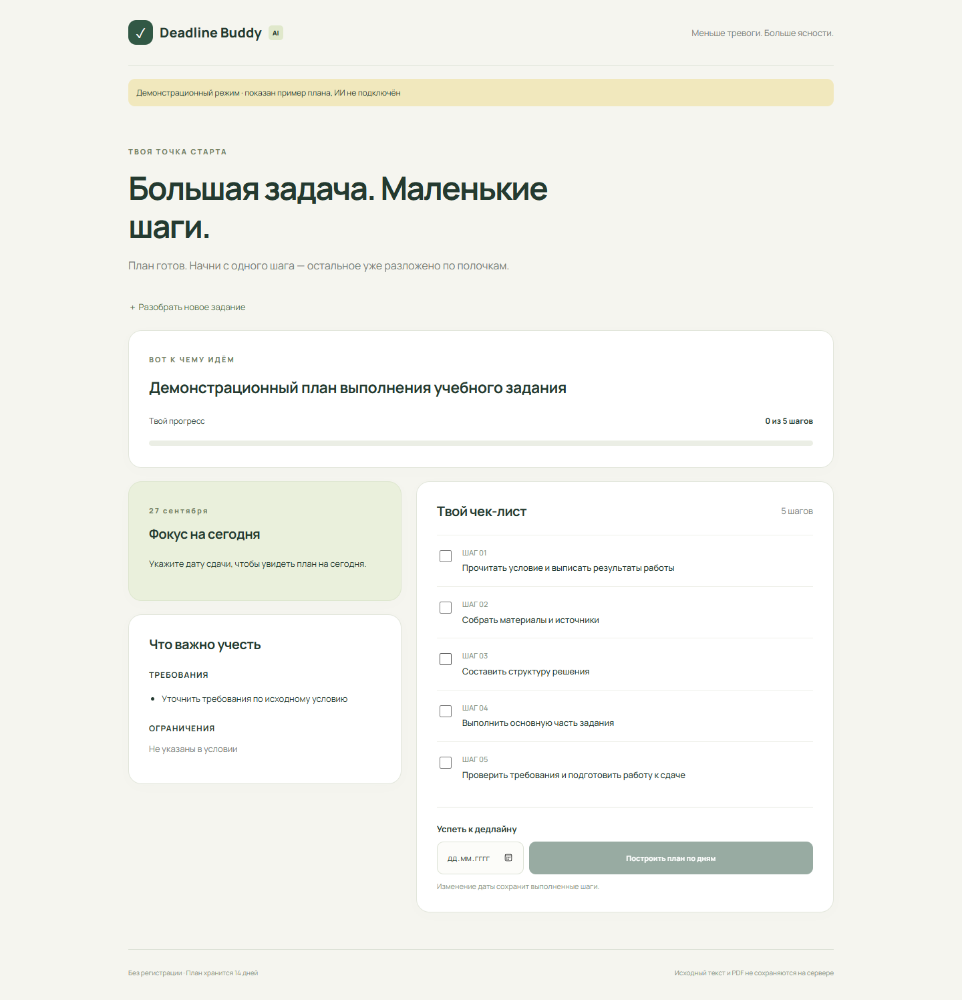
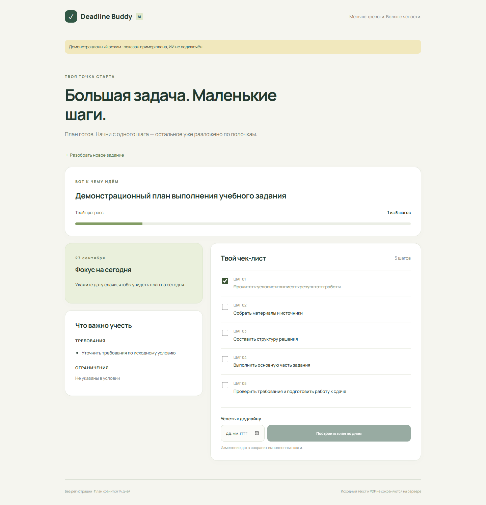
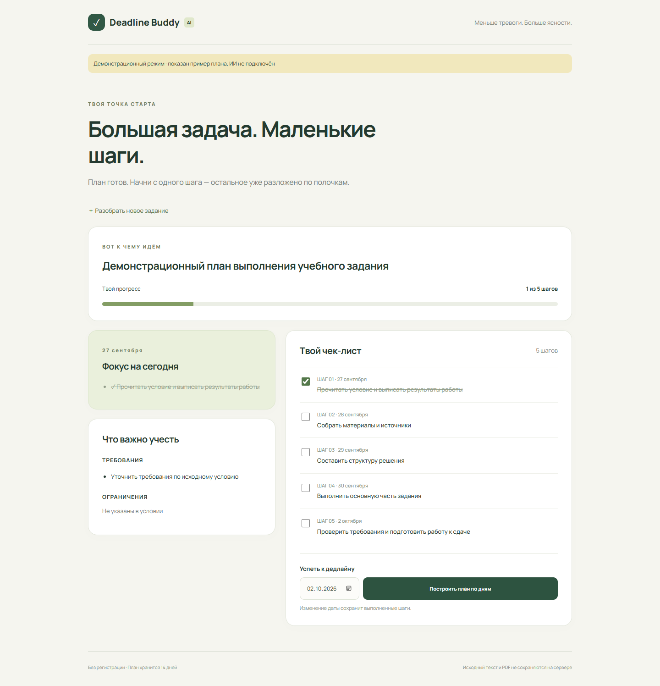
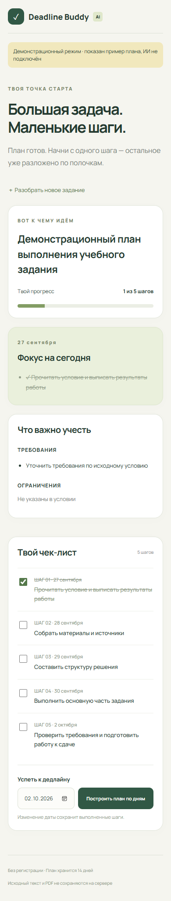

# Deadline Buddy AI — отчёт о реализации и инструкция пользователя

## 0. Введение

**Название проекта:** Deadline Buddy AI.

**Репозиторий:** [Deadline-Buddy-AI](https://github.com/MalyySarder/Deadline-Buddy-AI).

**Адрес MVP:** [http://127.0.0.1:8000](http://127.0.0.1:8000) после локального запуска по [README](README.md). Публичное размещение на сервере ещё не выполнено.

**Для кого:** для студентов, которым трудно выделить требования из условия и понять, с чего начать учебное задание.

**Что делает:** превращает текст или PDF задания в цель, требования, ограничения, чек-лист и план по дням.

**Время знакомства:** около 5 минут. Разбор ограничен 29 секундами на сервере, ожидание браузера — 30 секундами.

Реализованы все три функции MVP. Скриншоты ниже получены в работающем деморежиме: он возвращает фиксированный пример и явно помечен жёлтой плашкой. Настоящий AI-разбор требует ключа LLM; качество ответа живого провайдера в рамках этой проверки не оценивалось.

## 1. Первый вход в продукт

1. Запустите приложение по README или получите адрес развёрнутой версии у администратора.
2. Откройте адрес в браузере. Регистрация и пароль не нужны.
3. На первом экране появятся поле «Условие задания», загрузка PDF, необязательная дата сдачи и кнопка «Разобрать задание».
4. Подготовьте полное условие объёмом 200–20 000 символов или PDF до 5 МБ с текстовым слоем.

Пока текст и файл отсутствуют, кнопка разбора неактивна. Если в браузере уже есть действующая сессия, открывается сохранённый план.

*Рисунок 1. Стартовый экран: форма ввода и три основных этапа работы.*

## 2. Основная функция №1 — разбор задания

Функция помогает понять, что именно нужно подготовить и какие условия соблюдать.

1. Вставьте условие в текстовое поле или нажмите «Загрузить PDF» и выберите файл.
2. При необходимости укажите дату сдачи. Её можно добавить и после разбора.
3. Нажмите «Разобрать задание».
4. Пока отображается «Разбираем задание…», форма заблокирована. Дождитесь ответа — до 30 секунд.
5. Прочитайте цель и блок «Что важно учесть»: требования и ограничения.

Если введены и текст, и файл, используется текст. PDF со сканами без текстового слоя не распознаётся: OCR не входит в MVP.

**Пример входных данных:**

> Подготовить учебный проект по анализу данных. Собрать данные, проверить пропуски, построить графики и написать выводы. Предоставить отчёт на 15 страниц и презентацию на 10 слайдов. Указать источники и описать ограничения выбранного метода.

*Рисунок 2. Полное условие введено; кнопка разбора активна.*

В рабочем режиме результат зависит от условия. Для приведённого примера ожидаются требования об отчёте и презентации. В деморежиме показана цель «Демонстрационный план выполнения учебного задания» и общий пример шагов; это не результат анализа данного текста моделью.

*Рисунок 3. Результат в деморежиме: цель, требования, ограничения и чек-лист. До указания дедлайна блок «Сегодня» предлагает выбрать дату.*

## 3. Основная функция №2 — пошаговый чек-лист

Чек-лист превращает большую работу в последовательность конкретных действий и показывает прогресс.

1. После разбора найдите блок «Твой чек-лист».
2. Выполните первый подходящий шаг.
3. Нажмите на флажок рядом с ним. После сохранения шаг зачеркнётся, а счётчик прогресса обновится.
4. Чтобы отменить отметку, нажмите на флажок повторно.
5. Обновите страницу: в том же браузере план и отметки восстановятся.

**Пример:** входное действие — отметить «Прочитать условие и выписать результаты работы»; результат — флажок включён, счётчик показывает «1 из 5 шагов».

*Рисунок 4. Первый шаг выполнен; прогресс сохранён на сервере.*

Кнопка «Разобрать новое задание» раскрывает форму. После нового успешного разбора старый план заменяется, а отметки сбрасываются. Если разбор закончился ошибкой, прежний план остаётся.

## 4. Основная функция №3 — план до дедлайна

Функция назначает шагам даты и выделяет задачи текущего дня.

1. В блоке «Успеть к дедлайну» выберите сегодняшнюю или будущую дату.
2. Нажмите «Построить план по дням».
3. Посмотрите даты у шагов и блок «Фокус на сегодня».
4. Если срок изменился, выберите другую дату и повторите построение. Уже выполненные шаги останутся отмеченными.

**Пример:** на скриншоте план построен 27 сентября 2026 года до 2 октября 2026 года. Первый шаг приходится на 27 сентября, последний — на 2 октября. Конкретные даты при использовании продукта зависят от дня запроса.

*Рисунок 5. Даты распределены по шагам, задача на текущую дату показана слева. Отметка выполненного шага сохранена.*

Если дедлайн сегодня, все шаги назначаются на сегодня. Если дней больше, чем шагов, некоторые дни могут остаться свободными. Просроченные невыполненные шаги отмечаются в чек-листе; в блоке «Сегодня» отображаются только шаги с сегодняшней датой.

## 5. Что делать, если что-то пошло не так

| Сообщение или ситуация | Что делать |
|---|---|
| «Слишком коротко» | Вставить полное условие — минимум 200 символов после нормализации пробелов. |
| «Текст длиннее 20 000 символов» | Убрать лишнее, сохранив требования и ограничения. |
| «Файл больше 5 МБ» | Выбрать меньший PDF или вставить текст вручную. |
| «Нужен файл PDF» | Загрузить PDF вместо DOCX, изображения или другого формата. |
| «В PDF нет текста» | Скопировать условие вручную; сканы и защищённые PDF не поддерживаются. |
| «Дата сдачи некорректна или уже прошла» | Выбрать дату не раньше сегодняшней. |
| «Сервис ИИ перегружен» | Подождать минуту и повторить разбор. |
| Разбор занял слишком много времени | Повторить запрос; ранее сохранённый план останется доступным. |
| Не удалось разобрать задание | Повторить запрос. При повторении администратору проверить настройки модели. |
| Сессия истекла | Выполнить новый разбор. Сессия действует 14 дней. |
| Нет соединения с сервером | Проверить подключение и запуск приложения. |
| Для разбора нужно настроить ключ | Администратору заполнить `LLM_API_KEY` в `.env` и перезапустить приложение. |

## 6. Частые вопросы

**Нужна ли регистрация?** Нет. Сессия определяется cookie браузера.

**Сколько хранится план?** 14 дней с момента создания сессии. После истечения он недоступен, записи удаляются фоновым процессом. Удаление cookie лишает браузер доступа к плану.

**Можно ли загрузить фото задания?** Нет. MVP принимает текст или PDF с текстовым слоем. Распознавание изображений не реализовано.

**Сохраняется ли исходное условие?** Приложение не сохраняет его в БД и не пишет в логи. PDF используется для извлечения текста и закрывается; исходный текст передаётся внешнему LLM-провайдеру для разбора. Политика хранения провайдера зависит от выбранного сервиса.

**Можно ли работать с телефона и менять дедлайн?** Да. Интерфейс адаптирован для узкого экрана, изменение даты не сбрасывает выполненные шаги. Перенос плана между браузерами без аккаунта не предусмотрен.

*Рисунок 6. Мобильный интерфейс шириной 390 px; блоки расположены в одну колонку.*

## Приложение. Результаты проверки реализации

| Проверка | Результат |
|---|---|
| Автоматические тесты API | 15 passed |
| Production-сборка React | Успешно |
| Ввод → разбор → чекбокс → дедлайн | Пройдено в браузере в деморежиме |
| Сохранение после перезагрузки | Пройдено |
| Мобильный экран 390 px | Горизонтального переполнения нет |
| Ошибки JavaScript в браузерном сценарии | Не обнаружены |
| Три разных задания | Успешно обработаны в деморежиме; качество AI не оценивалось |
| Повтор LLM / 429 / таймаут / неверный JSON | Проверено HTTP-заглушками |
| Реальный LLM-провайдер | Не проверен: API-ключ не предоставлен |
| Docker / VPS | Файлы запуска подготовлены; развёртывание не выполнялось |

Технологии: Python, FastAPI, SQLite, pypdf, React, Vite. Настройки вынесены в `.env`, `config.yaml` и файл промпта. API и решения по неоднозначностям ТЗ описаны в README.
